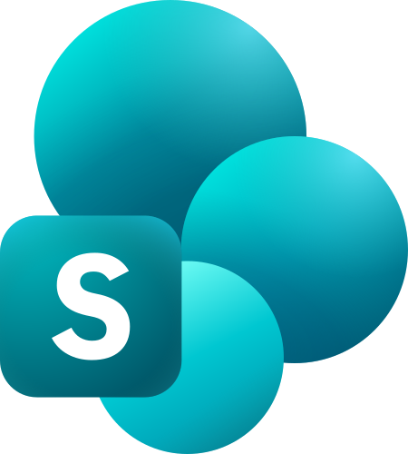
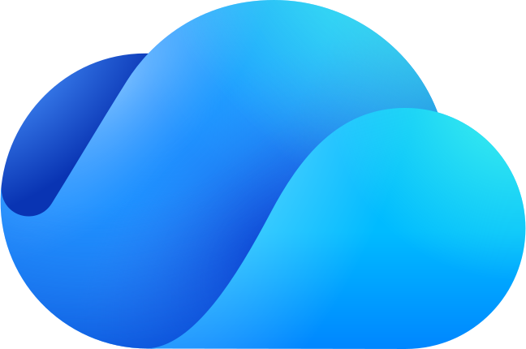
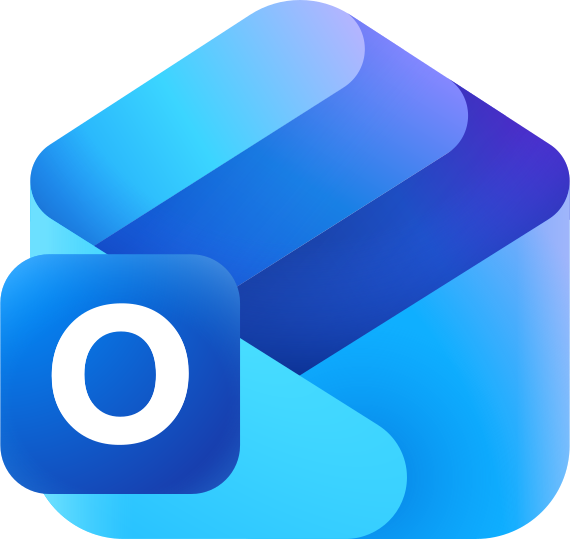
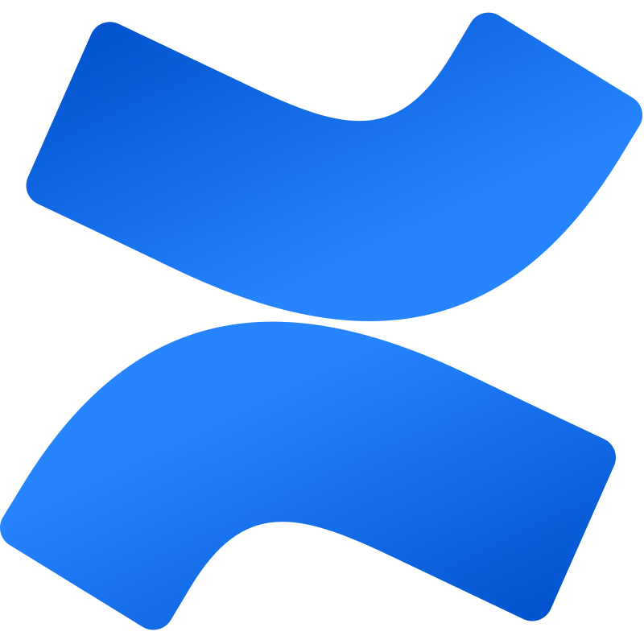
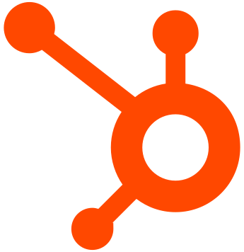
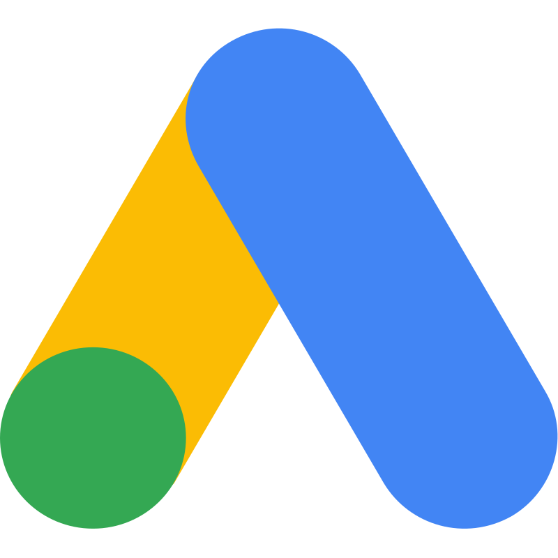

**Omni is an AI Agent Platform for the Workplace.**

Connect your company’s apps, create a unified context layer over workplace knowledge, and deploy agents that can search, reason, and act across your organization.

[Documentation](https://docs.getomni.co)  •  [Deployment](#deployment)  •  [Features](#features)  •  [Architecture](#architecture)

---

## What is Omni?

Omni is a self-hosted AI agent platform for the workplace.

It connects to tools like Google Drive, Gmail, Slack, Confluence, Jira, HubSpot, and internal file systems, indexes your company knowledge, and gives agents the context they need to answer questions, analyze information, and help employees get work done.

Instead of wiring every agent directly to every business system, Omni gives you a shared context and tool layer for workplace AI.

## Features

- **Workplace AI Agents**: Build agents that can search company knowledge, read documents, analyze data, and use tools to complete work.
- **Unified Context Layer**: Index Google Drive/Gmail, Slack, Confluence, Jira, HubSpot, local files, websites, and more into one searchable knowledge layer.
- **Hybrid Search**: Full-text BM25 search with ParadeDB and semantic search with pgvector, all inside Postgres.
- **Tool Use & Code Execution**: Agents can execute Python and bash in a sandboxed container to inspect files, analyze data, and generate outputs.
- **Self-hosted by Design**: Run Omni entirely on your own infrastructure. Your data stays within your cloud/on-prem environment.
- **Permission Inheritance**: Respects source system permissions. Users only see data they're already authorized to access.
- **Bring Your Own LLM**: Anthropic, OpenAI, Gemini, AWS Bedrock, Vertex AI, Azure AI Foundry, or any OpenAI-compatible endpoint (vLLM, Ollama, LM Studio, LiteLLM, etc.).
- **Simple Deployment**: Docker Compose for single-server setups, Terraform for production AWS/GCP deployments.

## Architecture

Omni uses **Postgres ([ParadeDB](https://paradedb.com))** as the core data layer for BM25 full-text search, pgvector semantic search, and application data.

No Elasticsearch. No dedicated vector database. One database to tune, backup, monitor, and operate.

Core services are written in **Rust** for search, indexing, and connector orchestration; **Python** for AI and LLM orchestration; and **SvelteKit** for the web frontend. Each connector runs as its own lightweight container, allowing integrations to use different languages and dependencies without affecting the rest of the system.

The agent runtime can execute code in a sandboxed container on an isolated Docker network, with no access to internal services or the internet. It uses Landlock filesystem restrictions, resource limits, and a read-only root filesystem.

See the full [architecture documentation](https://docs.getomni.co/architecture) for more details.

## Deployment

Omni can be deployed entirely on your own infra. See our deployment guides:

- [Docker Compose](https://docs.getomni.co/deployment/docker-compose)
- [Terraform (AWS/GCP)](https://docs.getomni.co/deployment/aws-terraform)

## Supported Integrations

### Google Workspace

<table border="0" cellpadding="20" cellspacing="0">
  <tr>
    <td align="center" width="150">&nbsp;  &nbsp;</td>
    <td align="center" width="150">&nbsp;  &nbsp;</td>
    <td align="center" width="150">&nbsp;  &nbsp;</td>
  </tr>
  <tr>
    <td align="center" width="150"><small><b>Google&nbsp;Drive</b></small></td>
    <td align="center" width="150"><small><b>Gmail</b></small></td>
    <td align="center" width="150"><small><b>Google&nbsp;Chat</b></small></td>
  </tr>
</table>

### Microsoft 365

<table border="0" cellpadding="20" cellspacing="0">
  <tr>
    <td align="center" width="150">&nbsp;  &nbsp;</td>
    <td align="center" width="150">&nbsp;  &nbsp;</td>
    <td align="center" width="150">&nbsp;  &nbsp;</td>
    <td align="center" width="150">&nbsp;  &nbsp;</td>
  </tr>
  <tr>
    <td align="center" width="150"><small><b>SharePoint</b></small></td>
    <td align="center" width="150"><small><b>OneDrive</b></small></td>
    <td align="center" width="150"><small><b>Outlook&nbsp;&amp;&nbsp;Calendar</b></small></td>
    <td align="center" width="150"><small><b>Teams</b></small></td>
  </tr>
</table>

### Knowledge Base & Documents

<table border="0" cellpadding="20" cellspacing="0">
  <tr>
    <td align="center" width="150">&nbsp;  &nbsp;</td>
    <td align="center" width="150">&nbsp;  &nbsp;</td>
    <td align="center" width="150">&nbsp;  &nbsp;</td>
    <td align="center" width="150">&nbsp;  &nbsp;</td>
    <td align="center" width="150">&nbsp;  &nbsp;</td>
    <td align="center" width="150">&nbsp;  &nbsp;</td>
  </tr>
  <tr>
    <td align="center" width="150"><small><b>Confluence</b></small></td>
    <td align="center" width="150"><small><b>Notion</b></small></td>
    <td align="center" width="150"><small><b>Nextcloud</b></small></td>
    <td align="center" width="150"><small><b>Paperless-ngx</b></small></td>
    <td align="center" width="150"><small><b>Web</b></small></td>
    <td align="center" width="150"><small><b>Local&nbsp;Files</b></small></td>
  </tr>
</table>

### Communication & Meetings

<table border="0" cellpadding="20" cellspacing="0">
  <tr>
    <td align="center" width="150">&nbsp;  &nbsp;</td>
    <td align="center" width="150">&nbsp;  &nbsp;</td>
    <td align="center" width="150">&nbsp;  &nbsp;</td>
  </tr>
  <tr>
    <td align="center" width="150"><small><b>Slack</b></small></td>
    <td align="center" width="150"><small><b>Fireflies</b></small></td>
    <td align="center" width="150"><small><b>IMAP</b></small></td>
  </tr>
</table>

### Project Management & Engineering

<table border="0" cellpadding="20" cellspacing="0">
  <tr>
    <td align="center" width="150">&nbsp;  &nbsp;</td>
    <td align="center" width="150">&nbsp;  &nbsp;</td>
    <td align="center" width="150">&nbsp;  &nbsp;</td>
    <td align="center" width="150">&nbsp;  &nbsp;</td>
  </tr>
  <tr>
    <td align="center" width="150"><small><b>Jira</b></small></td>
    <td align="center" width="150"><small><b>GitHub</b></small></td>
    <td align="center" width="150"><small><b>ClickUp</b></small></td>
    <td align="center" width="150"><small><b>Linear</b></small></td>
  </tr>
</table>

### Business Apps

<table border="0" cellpadding="20" cellspacing="0">
  <tr>
    <td align="center" width="150">&nbsp;  &nbsp;</td>
    <td align="center" width="150">&nbsp;  &nbsp;</td>
    <td align="center" width="150">&nbsp;  &nbsp;</td>
  </tr>
  <tr>
    <td align="center" width="150"><small><b>HubSpot</b></small></td>
    <td align="center" width="150"><small><b>Google&nbsp;Ads</b></small></td>
    <td align="center" width="150"><small><b>Darwinbox</b></small></td>
  </tr>
</table>

## Build a Connector

Use the [Connector SDK](https://docs.getomni.co/developers/sdk-overview) to build your own integrations with Omni.

See [CONTRIBUTING.md](CONTRIBUTING.md) for development setup and guidelines.

If you use [Claude Code](https://docs.anthropic.com/en/docs/claude-code), this repo includes a skill to help build connectors. Run `/build-connector <service name>` (e.g., `/build-connector Asana`).

## License

Apache License 2.0. See [LICENSE](LICENSE) for details.

---

[Documentation](https://docs.getomni.co) • [Discussions](https://github.com/getomnico/omni/discussions)

